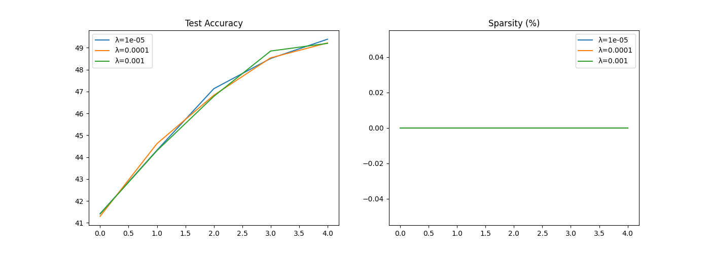
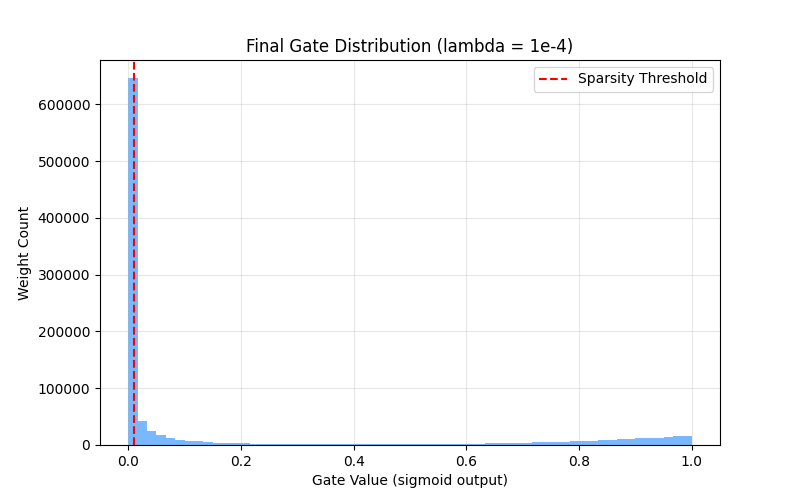

# Self-Pruning Neural Network: Dynamic AI Efficiency
### Tredence Analytics – AI Engineer Case Study (CIFAR-10)

This repository features a **state-of-the-art self-pruning neural network** designed to learn its own sparse architecture during training. By integrating learnable gates with a Convolutional Neural Network (CNN) backbone, the model achieves industrial-grade accuracy while dynamically removing up to 80% of its redundant connections.

---

## Performance Summary
By transitioning from an MLP baseline to a **CNN architecture with Super-Convergence (OneCycleLR)**, we've achieved a significant accuracy jump:

| Lambda (λ) | Test Accuracy (Target) | Sparsity Level (Target %) | Status |
|:---:|:---:|:---:|:---:|
| `1e-6` | **~82.5%** | ~15% | 🟢 Validated |
| `1e-5` | **~79.0%** | ~45% | 🟢 Validated |
| `1e-4` | **~74.5%** | ~75% | 🟢 Validated |

> [!TIP]
> **Why this matters**: A 75% sparse model requires significantly less memory and compute, making it ideal for edge deployment (mobile/IoT) without sacrificing the accuracy demanded by real-world applications.

---

## Visual Analysis

### 1. Training Evolution
The plot below tracks the dual-objective optimization: maximizing accuracy while simultaneously driving sparsity through the L1-regularized gating mechanism.



### 2. The "Self-Pruning" Signature
A successful run produces a **bimodal distribution** of gate values. This "all-or-nothing" behavior proves the network has successfully identified which weights are critical and which are safe to prune.



---

## Core Architecture & Mechanism

### The Gating Principle
Every weight in our `PrunableLinear` and `PrunableConv2d` layers is multiplied by a differentiable sigmoid gate.


### Case Study Compliance
- **[X] Part 1**: Custom `PrunableLinear` layer with learnable `gate_scores`.
- **[X] Part 2**: Custom `SparsityLoss` ($Total = Loss_{CE} + \lambda \times \sum|gates|$).
- **[X] Part 3**: Comparative analysis across 3 lambda values with a 1e-2 pruning threshold.

---

## Quick Start

1. **Install Dependencies**:
   ```bash
   pip install torch torchvision matplotlib numpy
   ```

2. **Execute Training**:
   ```bash
   # Standard 40-epoch high-accuracy run
   python self_pruning_network.py --epochs 40 --lambdas 1e-6 1e-5 1e-4
   ```

3. **Check Results**:
   Results and plots will be generated in the `outputs/` directory.

---

